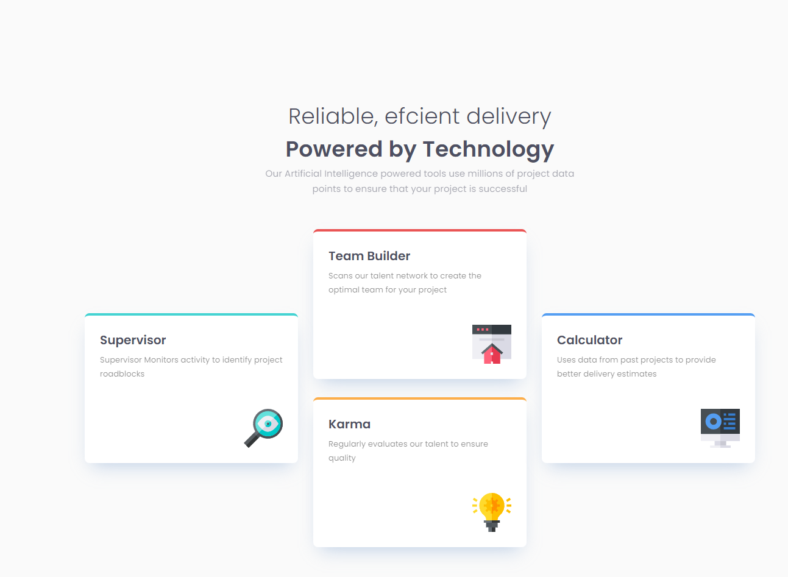

# Frontend Mentor - Four card feature section solution

### The challenge

Users should be able to:

- View the optimal layout for the site depending on their device's screen size

### Screenshot

### Links

<<<<<<< HEAD
- Solution URL: [Solution URL](https://github.com/nsart75/Four-card-feature-section)
- Live Site URL: [Live site URL](https://nsart75.github.io/Four-card-feature-section/)

=======
- Solution URL: (https://github.com/nsart75/Four-card-feature-section)
- Live Site URL: (https://nsart75.github.io/Four-card-feature-section/)
>>>>>>> e14645712d27074450accd747e182a1ccb104ca5

### Built with

- Semantic HTML5 markup
- CSS custom properties

## Author

- Website - Seyd Ali reza Tabatabaei
- Frontend Mentor - [@Erfan Atarzade](https://devedoping.ir/course/frontend-mentoring/)

